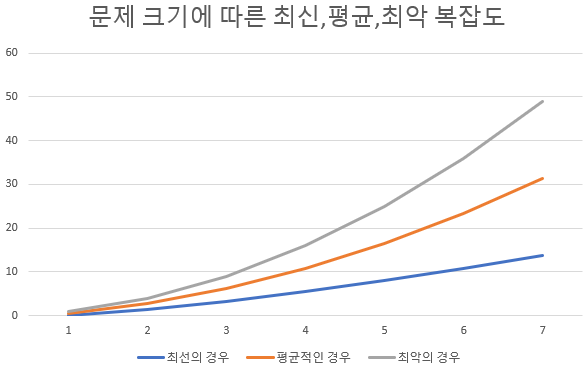
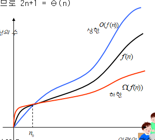

# <빅오, 자료형>

- big-O (빅오)
  - 입력값이 커질 때 알고리즘의 실행 시간(시간 복잡도)과 함께 공간 요구사항(공간 복잡도)이 어떨게 증가하는지를 분류하는데 사용
  - 빅오의 개념
  - 시간 복잡도를 분석할 때 '상한'과 '최악'의 경우에 대해 혼동하는 부분이 있음
  - 불할 상환: 함수의 동작을 설명하는 매우 중요한 방법 중 하나
  - 파이썬의 자료형
  - 파이썬 자료형의 특징

## 1. 빅오
### (1) 빅오
- 빅오는 점근전 실행 시간(Asymptotic Running Time)을 표기할 때 가장 널리쓰이는 수학적 표기 중 하나.
- 점근전 실행 시간(Asymptotic Running Time) : 입력값 n이 커질 때 (입력값이 무한대를 향할 때) 함수의 실행 시간의 추이
- 충분이 큰 입력에서는 알고리즘의 효율성에 따라 수행 시간이 크게 차이다 날 수 있다.
- 점근적 실행시간은 시간 복잡도라고 할 수 있다.
- 시간 복잡도(Time Cimplexity) : 어떤 알고리즘을 수행하는데 걸리는 시간을 설명하는 계산 복잡도(Computational Complexity)
- 계산 복잡도를 표기하는 대표적 방법이 빅오 이다.
- 시간 복잡도를 표기할 때에는 **입력값에 따른 알고리즘의 실행 시간의 추이만 고려한다**
- 빅오로 시간 복잡도를 표기할 때에는 최고차항만을 표기한다.(상수항 무시)
  - 4n^2+3n+4 의 경우 상수 무시, 최고차항만 고려하여 n^2만을 표기한다.
  - 이 경우 시간복잡도는 O(n^2)이 된다.
- **추이에 따른 빅오 표기법 종류**
  - O(1) :
    - 입력값이 커져도 실행시간이 일정 (상수의 시간을 갖는다)
    - 해시 테이블 조회 및 삽입이 해당됨
  - O(log n) :
    - 로그는 매우 큰 입력값에도 완만한 기울기를 갖는다.
    - 이진검색이 해당됨
  - O(n) :
    - 입력값과 비례하게 실행 시간이 영향을 받음.
    - 이러한 알고리즘을 선형 시간(Linear-Time)알고리즘 이라고 한다.
    - 정렬되지 않은 리스트에서 max 또는 min의 경우가 해당됨.
    - 모든 입력값을 적어도 한번 이상은 살펴봐야 한다.
  - O(nlog n) : 
    - 병합 정렬 등 대부분 효율 좋은 정렬 알고리즘이 해당됨.
  - O(n^2) : 
    - 버블정렬 같은 비효율적인 정렬 알고리즘이 해당됨.
  - O(2^n) : 
    - 피보나치 수 를 재귀로 계산하는 알고리즘이 해당됨
  - O(n!) :
    - 각 도시를 방문하고 돌아오는 가장 짧은 경로를 찾는 외판원문제(Travelling Salesman Problem_TSP)를 브루트 포스로 풀이할 때가 이에 해당됨.
    - 가장 느린 알고리즘이다.
- 빅오는 시간 복잡도 외에 공간 복잡도를 표현하는 데이도 널리 쓰인다.
- 알고리즘은 '시간과 공간이 트레이드오프(Space-Time Tradeoff) 관계다.
  - 실행 시간이 빠른 알고리즘은 공간을 많이 사용하고, 공간을 적게 차지하는 알고리즘을 실행 시간이 느리다.

### (2) 상한과 최악
</br>
- 빅오(O)는 상한(Upper Bound)을 의미</br>  
</br>
- 빅오메가(Ω)는 하한(Lower Bound)를 의미</br>
</br>
- 빅세타(θ)는 평균을 의미</br>

- 학계와 달리 업계에서는 빅세타와 빅오를 하나로 합쳐 단순화해서 표현하려는 경향이 있음.</br>


- **<U>상한을 최악의 경우와 혼동하는 경우</U>**
  -  빅오 표기법은 복잡한 함수를 '적당히 정확하게' 표현하는 방법일 뿐, <U>최악의 경우/평균적인 경우의 시간 복잡도와는 아무런 관계가 없는 개념.</U>
  - **<(EX) 최대/평균/최악의 경우의 개념>**

    - N=4일 때 최선의 경우에 비해 최악의 경우 약 3배 이상의 연산이 필요하다.
    - 퀵 정렬의 로무토 파티션(Lomuto Partition)의 경우
      - Lomuto Partition : 피벗을 정할 때 가장 우측을 택하는 가장 단순한 피벗 선택 방식)
      - 입력값이 [1,4,3,7,8,6,5] 일 때, 이 입력값은 "최선의 경우" 에 해당됨.
        - 이 경우 모두 정렬하기 위해 18번의 비교 또는 스왑 연산이 필요하다. n=7 이므로 O(nlog(n))에 가깝다.
      - 입력값이 [1,2,3,4,5,6,7]일 경우 "최악의 경우" 에 해당됨.
        - 이 경우 48번의 연산을 수행하며 7*7=49 이므로 O(n^2)에 가깝다.
      - n=7 일 때 최선,평균,최악의 연산 횟수는 각각 18,24,48이며 빅오와는 관련이 없는 개념이다.
  - **<(EX) 빅오 표기의 개념>**

    - **빅오는** 위 그림과 같은 복잡한 함수 f(n)이 있을 경우, 이 함수의 실행 상한과 하한을 의미한다.
    - 가장 빨리 실행될 때 : 하한 (빅오메가Ω)
    - 가장 늦게 실행 될 때 : 상한 (빅오 O)
    - 평균적으 실행될 때 : 빅세타 (θ)
    - n0 : n이 작을 때를 말함. 이 경우는 무시한다.
    - 빅오 표기법은 n이 매우 클 때의 전체적인 큰 그림에 집중한다. 

- ### <빅오 표기법은 주어진(최선/최악/평균)경우의 수행 시간의 상한을 나타낸다!!>


- 퀵 정렬에서 "최선의 경우 O(nlog(n))이다" 라는 말은 입력값이 [1,4,3,7,8,5]일 때 '최대 연산'이 nlog(n) 이내라는 의미.
  - 7ln(7)=13.6 정도이며 최선의 경우 연산 횟수는 18이므로 상수항이 생략됨을 감안하면 비슷한 수치.
- "최선의 경우 O(n^2)이다" 라는 명제도 참이다.
  - 빅오는 상한을 의미하므로 실 연산 횟수가 이보다 작기만 하면 되기 때문.
- "최선의 경우 O(n^3)이다" 라는 명제도 참이다.
  - 하지만 이런 경우 상한을 지나치게 높게 설정했기 때문에 아무런 의미가 없다.
### (3) 분할 상환 분석
- 분할 상환 분석(Amortized Analysis) : 빅오와 함께 함수의 동작을 설명할 때 중요한 분석 방법 중 하나.
- 최악의 경우를 여러 번에 걸쳐 골고루 나눠주는 형태로 알고리즘의 시간 복잡도를 계산할 수 있다.
- 시간 복잡도를 분석할 때 매우 보편적으로 널리 사용됨.
# **분할 상환 분석 좀 더 공부해서 정리하기**

### (4) 병렬화
- 알고리즘 자체의 시간 복잡화 외에 알고리즘이 병렬화 가능성은 근래에 알고리즘 우수성을 평가하는 매우 중요한 척도 중 하나디아.

## 2. 자료형
### (1) 파이썬 자료형
<Python 3.7기준의 자료형>


#### - 숫자 (class float, class int, class bool)
- 파이썬에서는 숫자 정수형으로 int만을 제공한다.
- PEP 237 로드맵에 따라 버전3 부터 int단일형으로 통합됨
- 기본 정수형인 int가 임의 정밀도 연산까지 수행한다.
- 파이썬에서 고정 정밀도 정수형은 지원하지 않는다.(고정 정밀도 : C스타일의 int형과 같음)
- object > int > bool
  - int는 object의 하위 클래스이고, bool은 int의 서브 클래스 이다.
- bool은 논리자료형인데 (True==1, False==0) 내부적으로 정수값을 갖고있다.
- 임의정밀도란?
  - 무제한 자릿수를 제공하는 정수형
  - 자릿수 단위로 쪼개어 배열 형태로 표현한다.
#### - 매핑 (class dict)
- Mapping 타입 : 키와 자료형으로 구성된 복합 자료형
- 파이썬의 매핑타입의 자료형은 "딕셔너리" 이다.
#### - 집합 (class set)
- 파이썬의 집합 자료형인 set은 중복된 값을 갖지 않는 자료형.
- 집합 선언
```python
## 빈 집합 선언
>>> a=set() # 빈 집합 a 선언
>>> a
>>> type(a)
<<class 'set'>>

## 값이 포함된 집합 선언
>>> b={1,2,3} # value만 선언. 중괄호로 묶는다.
```
- set은 입력 순서가 유지되지 않으며, 중복값이 있을 경우 하나의 값만 유지한다.
```python
>>> a={3,2,3,5}
>>> a
{2,3,5}
```
#### - 시퀀스
- 시퀀스(Sequence) 특정 대상의 순서 있는 나열을 의미.
- str은 문자의 순서있는 나열로 문자열을 이루는 자료형이며, list는 다양한 값들을 배열 형태의 순서 있는 나열로 구성하는 자료형
- 불변(Immutable) : str, tuple, bytes (값을 변경 할 수 없다.)
  - str이 불변 시퀀스 자료형임을 2.4_Big_O&Datatype_code.ipynb 에서 알아본다.
- 가변(Mutable) : list (리스트는 자유롭게 값을 추가, 삭제할 수 있는 동적 배열)

#### - 원시타입 (Primitive Type)

|언어|자료 타입 형태|특징|
|---|--------|--------------|
|C|원시 타입|매우 빠른 연산 가능|
|자바|원시타입, 객체|원시타입에 대응되는 클래스 객체 : 여러 가지 작업 수행 가능. 메모리 점유율 많고 속도 감소|
|파이썬|객체|편리한 기능 제공 우선시. 객체의 다양한 기능과 편의성 우선. 느린속도, 많은 메모리 점유율|

#### - 객체

- 파이썬은 모든 것이 객체이다.
- 불변 객체(Immutable Object)
- 가변 객체(Mutable Object) 가 있다.
- 파이썬 자료형의 불변 객체 여부

|클래스|설명|불변 객체|
|----|--------------------|---|
|bool|부울|O|
|int|정수|O|
|float|실수|O|
|list|리스트|X|
|tuple|리스트와 튜플의 차이는 불변 여부이며 이외에는 거의 동일하다. 튜플은 불변이므로 생성할 때 설정한 값은 변경할 수 없다|X|
|str|문자|O|
|set|중복된 값을 갖지 않는 집한|X|
|dic|딕셔너리|X|

--------------------------------------------
- **불변객체**
  - 파이썬은 모든 것이 객체이다.
  - 파이썬에서 변수를 할당하는 작업은 해당 객체에 대해 참조를 한다는 의미.
  - 문자,숫자도 모두 객체이다.(확인은 2.4_Big-O&Datatype_code.ipynb에서 확인)
  - tuple은 불변이므로 dict의 키나 set의 값으로 사용 가능하지만 list는 가변이므로 ditc나 set의 값으로 추가할 수 없다.
- **가변객체**
  - list는 다른 변수가 이를 참조하고 있을 때 그 변수의 값 또한 변경이 가능하다.
- **C++참조와 비교**
  - C++ 
    - 파이썬과 동일하게 참조를 갖는다.
    - 참조 변수에 값을 할당하면 참조의 대상 또한 할당된 값으로 변경된다.
    - 
      ```c++
      // C++
      int a=10;
      int &b=a;
      b=7;
      std::cout<<a<<std::endl;
      -------------------------
      7
      ```
  - Python
  
      ```python
      >>> a=10
      >>> b=a
      >>> id(a), id(b)
      (4550544560, 4550544560)
      >>> b=7
      >>> a, id(a), id(b)
      (10, 4550544560, 4550533464)
      ```
    - b=a를 통해 동일한 메모리 주소를 참조하지만, b=7로 새로운 값을 할당해도 b변수는 a변수를 참조하지 않고 새로운 객체 7을 참조한다.
    - 불가변 객체의 경우 참조 변수에서 값을 조작 불가능
    - list와 같은 가변객체의 경우 참조 대상의 변수도 변경 가능
    - list 또한 '='연산자로 재할당 하게되면 다른 ID를 참조한다.
    ```python
    >>> a=[1,2,3]
    >>> b=a
    >>> b[2]=5
    >>> a
    [1,2,5]
    ```
- **One of 파이썬의 비교 연산자 is와 ==**
  - "is"는 id()값을 비교하는 함수
  - "=="는 값을 비교하는 연산자
  - None은 null이며 값 자체가 정의되어있지 않으므로 "=="로 비교 불가능. "is"로 비교 가능하다.
    ```python
      if a is None:
        pass
    ```
  - list를 생성하여 "is"와 "==" 비교
    ```python
    >>> a=[1,2,3]
    >>> a==a
    True
    >>> a == list(a)
    True
    >>> a is a
    True
    >>> a is list(a) # is는 주소값을 비교하는 비교연산자 이므로 False를 리턴한다.
    False
    ```
    - list()로 묶으면 별도의 객체로 복사가 되고 다른 ID를 갖게 되므로 is는 False 이다.
    ```python
    >>> a=[1,2,3]
    >>> a == copy.deepcopy(a)
    True
    >>> a is copy.deecopy(a)
    False
    ```
    - copy.deepcopy()로 복사한 결과 또한 값은 같지만 ID는 다르기 때문에 is로 비교할 경우 False를 리턴한다.
    - 
- **자료구조, 자료형, 추상자료형**
  - 자료구조(Data Struct) : 
    - 데이터에 효율적으로 접근하고 조작하기 위한 데이터의 조직, 관리, 저장구조를 말한다.
    - 일반적으로 원시 자료형을 기반으로 하는 배열, 연결리스트, 객체 등을 의미.
    - 여러 원시 자료형을 조합한 자료구조는 "복합자료형(Composite Data Type)이 된다.
  - 자료형(Data Type)
    - 컴파일러 또는 인터프리터에게 프로그래머가 데이터를 어떻게 사용하는지를 알려주는 일종의 데이터 속성(Attribute)이다.
    - 자료구조에 비해 구체적
    - 정수, 문자열, 실수등 해당 언어에서 지원하는 원시 자료형(Primitive)까지 포함하는 모든 자료 유형을 의미.
  - 추상 자료형(Abstract Data Type)
    - 약어 ADT
    - 자료형에 대한 수학적 모델을 지칭함.
    - 해당 유형의 자료에 대한 연산들을 명기한 것
    - 행동만을 정의할 뿐 실제 구현 방법은 명시하지 않음
    - OOP의 추상화(Abstraction)과 비슷한 개념
    - 필수적인 속성만 보여주고 불필요한 정보는 감춘다


