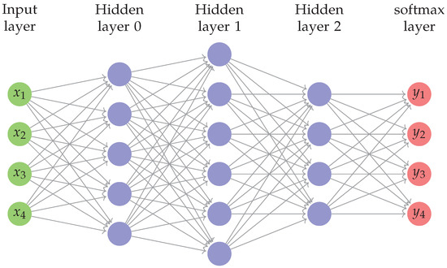
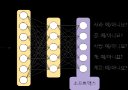
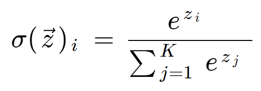

(** https://deepai.org/machine-learning-glossary-and-terms/softmax-layer 참고)
# 6. Sotfmax Rogistic Regression (Multinomial Logistic Regression)

## 1. What is Sotfmax Function?
- 입력받은 value를 출력으로 0~1 사이의 값으로 모두 정규화여 return하며 Probability 하고도 한다. 출력값들의 합은 항상 1이며 다중클레스 분류에 사용된다.
  
- Softmax function은 logistic regression에 사용되는 sigmoid function과 비슷며, class가 상호배타적(mutually exclusive, P(A or B)=P(A)+P(B)) 의 관계일 때 사용되는 classifier이기 때문에  multi-class logistic regression 이라도고 불린다. 
  
- multi-layer nn 의 output이 실수로 떨어지는 끝에서 두 번째의 layer의 경우 Softmax를 사용하여 정규화된 확률 분포로 변환하기 때문에 nn의 마지막 layer에 사용된다.
  
  

- 예를들어 이미지 분류의 경우 이미지가 특정 class에 속할 확률은 다음과 같다. 

- Softmax 회귀의 구조  
  
  $\begin{bmatrix} y_{1} \\ y_{2} \\ y_{3} \end{bmatrix}$ 
  = softmax ( $\begin{bmatrix} W_{1,1} \ \ \ W_{1,2} \ \ \ W_{1,3} \\\ W_{2,1} \ \ \ W_{2,2} \ \ \ W_{2,3} \\\ W_{3,1} \ \ \ W_{3,2} \ \ \ W_{3,3} \end{bmatrix}$
  . $\begin{bmatrix} x_{1} \\ x_{2} \\ x_{3} \end{bmatrix}$
  $+$ $\begin{bmatrix} b_{1} \\ b_{2} \\ b_{3} \end{bmatrix}$ )
  
  
## 2. Mathematical definition of the Softmax Formula

- ## $\vec{z_{i}}$: 
  Input vector(z→)로, Z0~Zk로 구성되어있음.
- ## $z_{i}$ : 
   Input vector의 원소. 어떠한 실수,0,양수,음수의 값의 할당이 가능하다.    ex) nn은 (-0.6,8.3,2.35,0) 과 같은 하나의 벡터를 output 갖을 수 있지만 확률분포의 값으로는 사용 불가능하므로 sotfmax를 사용하여 0-1사이의 값으로 정규화된 값으로 변형해야 한다.
- ## $e^{z_{i}}$ : 
   모든 원소에 대해 exponential function이 적용된다. 0상의 양의 값으로 반환되고 원소가 음의 값이라면 매우 작은 값이, 원소값이 매우 크면 큰 값이 반환된다.(아직 0-1사이의 값이 아님)
- ## $\sum_{i=1}^{K}{e^{z_{j}}}$ :  
  normalization term. 모든 output value가 1+0사이의 값을 정규화 하는 공식으로, 확률분포를 구성함.
  - ## **K** :  
    multi-class 에서 class의 수 

## 3. Calculating the Softmax
- 아래 input array늬 원소인 3개의  실수는 nn의 output이라 가정하고, 확률 분포로 전환해보자. 
$A=\begin{bmatrix}
8\\
5\\
0\\
\end{bmatrix}
$
 
1) input array의 각 원소 exponential 계산한다. 이는 위의 softmx 수식의 분자값을 의미한다. 
$e^{z_{1}} = e^{8} = 2981.0$ 
$e^{z_{2}} = e^{5} = 148.4$ 
$e^{z_{3}} = e^{0} = 1.0$ 

- 아직 확률값이 아니며, 분모값(nomerization term)을 계산하여 나눠줌 으로써 확률분포 값으로 리턴한다. 

2) Normalization term  
$\sum_{i=1}^{K}{e^{z_{j}}}$ :  
$\sum_{i=1}^{K}{e^{z_{j}}} = e^{z_{1}} + e^{z_{2}} + e^{z_{3}} = 2981.0  + 148.4 + 1.0 = 3130.4$ 

3) Normalization term을 각 원소의 exponential 값과 나눈다. 
   ** sotfmax는 array를 array로 (서로 length가 같음.해당 array length=3)  변형하기 때문에 single value로 output을 하지 않는다. 

## $\sigma(\vec{z})_{1}$ = $2981.0 \over 3130.4$
 = 0.9523 
## $\sigma(\vec{z})_{2}$ = $148.4 \over 3130.4$ 
= 0.0474 
## $\sigma(\vec{z})_{3}$ = $1.0 \over 3130.4$ 
= 0.0003 

- output value의 전체 합은 1이여야 한다.  
** 첫 번째 값인 8의 exponential 값은 5와 0에 비해 매우 큰 값이기 때문에 5,0의 확률값은 매우 작다는 것은 중요한 포인트임. 
기계학습 모델에서 softmax 함수를 사용하는 경우, 0또는 1에 매우 가까운 값을 생성하는 경향이 있다. 위의 예와 같은 경우 실제 신경망 예측에 더 많은 불확실성이 있을 수 있는 첫 번째 class에 95% 확률을 할당했을 것임.** 

## 4. Softmax function in code
(1) Softmax hypothesis  
    - Python : softmax=exp(logits)/reduce_sum(exp(logits),dim) 
    - TF1 : hypothesis = tf.nn.softmax(tf.matmul(X,W)+b) 
    - TF2 : tf.model.add(tf.keras.layers.Activation('softmax')) 
    - Pytorch : softmax=torch.nn.Sorfmax() 
                model=torch.nn.Sequential(linear,softmax) 
                

## 5. Sotfmax Function VS Sigmoid Sigmoid Function

- Softmax   
## $\sigma(\vec{z}_{i})$ = $e^{z_{i}} \over \sum_{i=1}^{K}{e^{z_{i}}}$  
(1) softmax 함수는 vector 연산을 진행  
(2) multi-input class 

- Sigmoid
## S(x) = $1 \over 1+e^{x}$  
(1) sigmoid 함수는 scalar 연산을 수행. 
(2) sigmoid 함수는 only two input classes 를 갖는 sotfmax라고 할 수 있다. 
(eg)  2개의 input을 갖는 vector가 아래와 같다면, 
$\begin{bmatrix} x \ \ \ 0 \end{bmatrix}$  
formular :  
## $\sigma{(\vec{z})}_{1}$ = $e^{z_{1}} \over e^{z_{1}} + e^{z_{2}}$ = $e^{x} \over e^{x}+e^{0}$ = $e^{x} \over e^{x}+1$    
## $e^{x}$ 로 나눠주면,  
## $\sigma(\vec{z})_{1}$ = $1 \over 1+e^{-x}$  
위의 계산식에서 다른 하나의 class는 따로 계산하지 않은 이유는 2개의 probabilities의 합은 1이기 때문이다.  
따라서, 2개의 class만 존재할 경우 vector 연산을 하는 softmax를 사용할 필요 없음. 

## 6. Softmax Function VS Argmax Function

- Argmax FUnction :  
## agrmax($\begin{bmatrix} z_{1} \\\ z_{2} \\\ .. \\\ z_{n} \end{bmatrix})$ = $\begin{bmatrix} y_{1} \\ y_{2} \\ .. \\ y_{n} \end{bmatrix}$ = $\begin{bmatrix} 0 \\ .. \\ 1 \\ 0 \end{bmatrix}$   
만약, $z_{i}$ 가 $\vec{z}$ 의 Max value 일때 $y_{i}$ = 1  
agrmax 함수는 softmax와 같이 vector 연산을 수행하며, 최댓값을 1로, 나머지 값은 0으로 return 한다. 
모델을 추론에 사용될 경우 이 함수를 사용한다.   

## 7. Cross-Entropy Cost Function 
** 텐서플로로 배우는 딥러닝 - 솔라리스 책 참고 ** 
- 소프트맥스 회귀 (Sotfmax Regression) 함수를 비롯만 분류 문제에는 corss-Entropy 손실함수를 많이 사용함.
- MSE(평균오차제곱값) 과 같이 모델의 예측값이 참과 비슷하면 작은 값, 다르면 큰 값을 갖는 함수의 형태  
  ## $\sum_{i=1}^{K}{e^{z_{j}}}$ :
  ## $H_{y^{'}}(y)$ = $- \sum_{i}^{}$ $y^{'}_{i}log(y_{i})$ 
  ## $y^{'}$ : 참값, y : 예측값
- 일반적으로 분류문제에서는  MSE보다 cross-entpopy 를 더 많이 사용. 
  ( 학습이 더 잘되는 것으로 알려짐)
# http://neuralnetworksanddeeplearning.com/chap3.html 참고하여 다시 정리하기..

